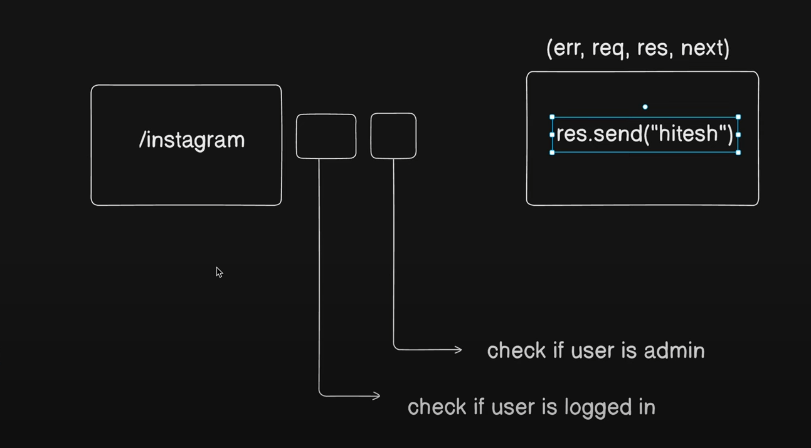

# Backend production grade practice

## Notes

### Database 

Database is always in another continent and while connecting your database try to wrap it in try-catch or async await 

### Database connection

There are two methods of connecting db -> one is to write its whole code in index.js and the other one is to write it in seperate file and export that in index.js

### configuration according to project 

we will use the module js so we will use "type" : "module" in the package.json file and while importing dotenv file 
we use: import dotenv 
dotenv.config({path:'./env})
and then in the package.json we will add -r dotenv/congig --experimental-josn-modules in the nodemon section of the Scripts section so that it downloads this.

app.use is used when we are using any middlewares.

now besides allowing the urls we want to allow the json objects, so we use app.use(express.json({limit: ""})) --> for cors \
then to allow all types of encoded urls we use app.use(express.urlencoded({extended:true, limit: ""})) \
to save any files we want in the server itself we use app.use(express.static("public")) \
to read and modify the data present in the cookies in the client we use the cookie-parser middleware app.use(cookieParser())

-[MiddleWare Concept]
-[Status Codes]

### Why we use Middlewares?

Middlewares are basically extra check function to check whether the request body is allowed to have access of the response or not.

in utility folder we will add the files which we will be reusing in the code like ApiError, asyncHandler , ApiResponse etc. \
for example, the apiError class will send a error message to the error handling middlewares during a req-res process from client to server.

### JWT, mongoose aggregation pipeline and bcrypt

while building the model section we will be using mongoose-aggreagation-pipeline-v2 for pagination and other custom queries.\
for encrypting and matching passwords we will be using bcrypt library. \
for access tokens and refreshtokens we will be using jwt or json web token library. 

This libraries will be used in the code after declaring the Schema in the models section.

JWT tokens are the bearer tokens. It means whoever has the token can have access of the server. site: JWT.io and in the npm site after searching 
"jsonwebtoken" we can see the github repo of it to understand the parameters and arguments it take while executing.\
There is also one thing, the logic and the token header string are set in the env file.

### Cloudinary and Multer

Cloudinary and multer services use ---> for file uploading. \
First, We take the files from user and store it in the local server using multer. Then, using cloudinary we take those files from the localserver 
and then upload in the AWS sever.

Cloudinary file is originally written inside the utils folder and in the cloudinary part we first config the cloudinary and then
checks the localfilepath and accordingly we save it to the clodinary server and return the function that does this.

Multer is basically used as a middleware to check if a file is stored in the localserver or not and we genrally write the multer section code in
the middleware folder. Then we take the diskstorage function of multer and stores the destination folder where we want the files to be stored 
locally and then we set the file name and then we return the function.

