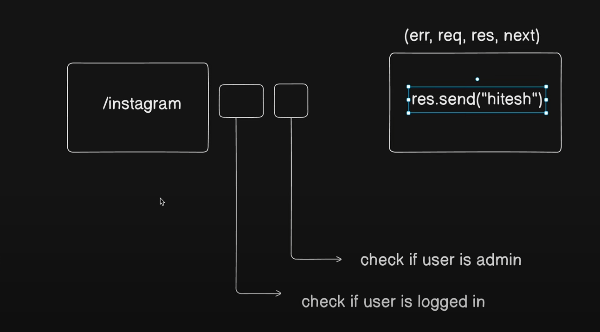
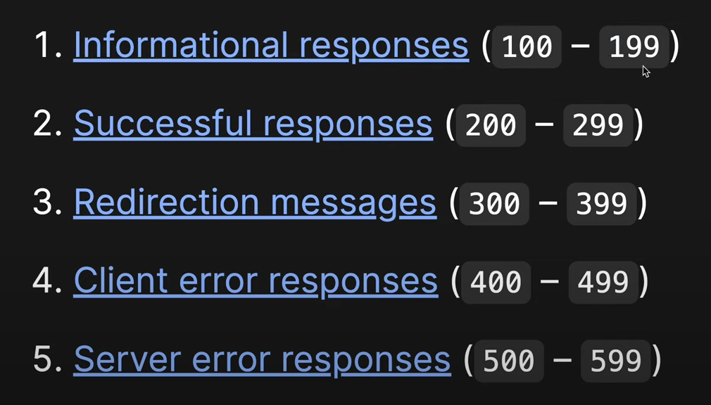

# Backend production grade practice

## Notes

### Database 

**Database is always in another continent and while connecting your database try to wrap it in try-catch or async await**

### Database connection

There are two methods of connecting db -> one is to write its whole code in index.js and the other one is to write it in seperate file and export that in index.js

### configuration according to project 

* we will use the module js so we will use "type" : "module" in the package.json file and while importing dotenv file 
* we use: import dotenv 
dotenv.config({path:'./env})
and then in the package.json we will add -r dotenv/congig --experimental-josn-modules in the nodemon section of the Scripts section so that it downloads this.

* app.use is used when we are using any middlewares.

* now besides allowing the urls we want to allow the json objects, so we use app.use(express.json({limit: ""})) --> for cors 
* then to allow all types of encoded urls we use app.use(express.urlencoded({extended:true, limit: ""})) 
* to save any files we want in the server itself we use app.use(express.static("public")) 
* to read and modify the data present in the cookies in the client we use the cookie-parser middleware app.use(cookieParser())

* -[MiddleWare Concept]
* -[Status Codes]

### Why we use Middlewares?

Middlewares are basically extra check function to check whether the request body is allowed to have access of the response or not.

in utility folder we will add the files which we will be reusing in the code like ApiError, asyncHandler , ApiResponse etc. \
for example, the apiError class will send a error message to the error handling middlewares during a req-res process from client to server.

### JWT, mongoose aggregation pipeline and bcrypt

* while building the model section we will be using mongoose-aggreagation-pipeline-v2 for pagination and other custom queries.
* for encrypting and matching passwords we will be using bcrypt library. 
* for access tokens and refreshtokens we will be using jwt or json web token library. 

* This libraries will be used in the code after declaring the Schema in the models section.

* JWT tokens are the bearer tokens. It means whoever has the token can have access of the server. site: JWT.io and in the npm site after searching 
* "jsonwebtoken" we can see the github repo of it to understand the parameters and arguments it take while executing.
* There is also one thing, the logic and the token header string are set in the env file.

### Cloudinary and Multer

Cloudinary and multer services use ---> for file uploading. 
* First, We take the files from user and store it in the local server using multer.
* Then, using cloudinary we take those files from the localserver 
and then upload in the AWS sever.

* Cloudinary file is originally written inside the utils folder and in the cloudinary part we first config the cloudinary and then
checks the localfilepath and accordingly we save it to the clodinary server and return the function that does this.

* Multer is basically used as a middleware to check if a file is stored in the localserver or not and we genrally write the multer section code in
the middleware folder. Then we take the diskstorage function of multer and stores the destination folder where we want the files to be stored 
locally and then we set the file name and then we return the function.

### export vs export default

* if we only write export then while importing we can not change its name 
* but in case of export default we can set the import function name as we wish.

### how to write controllers

first go to the controller and create a file and import the middleware (here asyncHandler). \
then write a function using the middleware and write the logic for the file (for eg: registering a user.)

### how to write routes

go to the routes folder and create a file. \
then import the corresponding controller function u want to use. \
then import Router and like express we write app = express(), here we write router = Router() \
then using router we write router.route(route name).method name( controller function name ) \
then at the end we export default router. \
then finally in the app.js section we first import the routes and then using middleware we write the specific url where we want to execute the 
function. \
app.use("route", routername)

### using the multer middleware

in the routes folder, while posting to a route we first use the middleware. Using the middleware we can take multiple fields and set their name and
maximum count. \
as express gives us the access of req.body similarly multer as middleware gives us the access of req.files.

One good thing about clodinary is if anything is not passed through cloudinary function.upload method it autometically considers it as empty string.
For example, if coverimage is not there while registering, cloudinary autometically sets it as empty string so that no error will occur.

### User vs user 

User is a object model that uses the functionalities of mongoose like findOne, findById etc.
user is an instance of the database object we request for and all the functions made by us is accessible via the user.

### Updating a data in the database

while changing the database data for a specific user we need to access the field by the instance of the database object we created (here user) and
then we set the new updated value and use instance_name.save() but while executing the save() function all the other fields of the model 
autometically involves to validate if the other fields are correct or not !  So, one thing is to input all the fields which are very time 
consuming.

The better approach is to use instance_name.save( {validateBeforeSave: false})

### Middleware during logout 

middleware: **"jawar age dekha kore jeo"**, it means just do something before the main functionality.
in case of register and login, we have the destructured field from the form about email, username etc. But in case of logout we can not ask about the email or username from the user because then by entering any valid username or email, that thing would be loggedout. 

So here we use the concept of middleware (here authmiddleware) to store the access and refreshToken of the user and pass it to the main function.
By validating the tokens we can verify if the current user is authenticated to logout or not!!

After configuring a middleware, we add it in the route.

Using the cookie-Parser middleware, all the fields in the main async function (here, req and res) has the access of the cookie and all other 
cookie-Parser functions.

It is not necessary that the current user has the access of accessTokens, sometimes using headers also in the mobile application we use **Authorization**
headers with the bearer token we can log in. So in that case we don't have directly the access of the req.cookie.accessToken; then we need to validate via **req.header("Authorization")?.replace("Bearer ","")**

cookie-Parser middleware .cookie function takes three paramters.
a. tokenName
b. tokenValue
c. options

Now while accessing the token via req.cookies we need to enter the tokenName we enter in the first place.

jwt.verify method takes two paramters -> a. token and b.tokenString and it returns the decoded token.

## Access Token vs Refresh Token

### Access Token
- **Purpose:** Used to authenticate API requests on behalf of the user.
- **Lifetime:** Short-lived, typically expires after a few minutes to an hour.
- **Security:** Highly sensitive and should be kept confidential. If exposed, it can be used to access the protected resources until it expires.
- **Usage:** Sent in the `Authorization` header of API requests as a Bearer token to access protected resources.
- **Renewal:** Requires the user to re-authenticate or use a refresh token to obtain a new access token.
- **Use Cases:**
  - **Single-Page Applications (SPA):** SPAs often use access tokens to authenticate API calls, allowing users to interact with the app seamlessly.
  - **Mobile Applications:** Access tokens enable secure communication with backend services.
- **Common Mistakes:**
  - **Storing in Local Storage:** Storing access tokens in local storage is insecure as they can be accessed by malicious scripts.
  - **Using Long-Lived Access Tokens:** This increases the risk window if the token is compromised.

### Refresh Token
- **Purpose:** Used to obtain a new access token without requiring the user to re-authenticate.
- **Lifetime:** Long-lived, often lasts days or months.
- **Security:** Sensitive and should be securely stored. If compromised, it can be used to generate new access tokens.
- **Usage:** Sent to the authentication server to request a new access token when the current one expires.
- **Scope:** Generally, refresh tokens are used solely for obtaining new access tokens and do not provide direct access to protected resources.
- **Use Cases:**
  - **Long Sessions:** Ideal for maintaining long-lived sessions without requiring users to log in frequently, such as in web applications or mobile apps.
  - **Background Processes:** Useful in scenarios where a background service needs to authenticate periodically without user interaction.
- **Common Mistakes:**
  - **Storing in Insecure Places:** Refresh tokens should not be stored in insecure places like local storage or as cookies unless they are `HttpOnly` and `Secure`.
  - **Not Revoking on Logout:** Failing to revoke refresh tokens on logout can lead to unauthorized access if a token is later compromised.

### Best Practices
- **Token Storage:** Store tokens in secure, http-only cookies when possible to protect against XSS attacks.
- **Token Expiry:** Implement short expiration times for access tokens and use refresh tokens to minimize risks.
- **Revoke Tokens on Logout:** Ensure that both access and refresh tokens are revoked when the user logs out to prevent unauthorized access.

